# 🌉 Soltania Vault Governance: The Hybrid Bridge

This project implements a secure hybrid bridge. It uses **HashiCorp Vault** (hosted locally or *On-Premise*) to generate and encrypt sensitive secrets, and then uses **Terraform** to securely inject these data into **GitHub Actions** workflows.

## 🏛️ Architecture

The diagram below illustrates the data flow: Vault acts as the security authority (Transit, PKI), and Terraform synchronizes the encrypted artifacts to the GitHub Cloud.

```mermaid
graph LR
    subgraph OnPrem ["🏢 On-Premise Infrastructure"]
        Vault[🦁 Vault Server]
        Vault --> Transit["🛡️ Transit (EaaS)"]
        Vault --> PKI["🔐 PKI Engine"]
    end

    subgraph Bridge ["🌉 Terraform Bridge"]
        Transit -.->|Encrypts Data| TF[Terraform]
        PKI -.->|Generates Certs| TF
    end

    subgraph Cloud ["☁️ GitHub Cloud"]
        TF == Injects ==> GH_Vars[GitHub Actions Variables]
        TF == Injects ==> GH_Sec[GitHub Actions Secrets]
    end

    %% Styles
    classDef vault fill:#2E3440,stroke:#88C0D0,color:#fff;
    classDef cloud fill:#ECEFF4,stroke:#5E81AC,color:#2E3440;
    class Vault,Transit,PKI vault;
    class GH_Vars,GH_Sec cloud;
```



-----

## 🚀 Technical Prerequisites

Before running the code, you must define the following environment variables to allow Terraform to authenticate with both Vault and GitHub.

### Required Variables

| Variable | Description | Example |
| :--- | :--- | :--- |
| `TF_VAR_vault_addr` | **The URL of your Vault server.** | `http://127.0.0.1:8200` |
| `TF_VAR_vault_token` | **Vault Authentication Token.**<br>Must have root or admin permissions. | `hvs.ImAToken...` |
| `GITHUB_TOKEN` | **GitHub Personal Access Token (PAT).**<br>Required to write secrets/variables. | `ghp_SecretToken...` |

### Quick Setup (Terminal)

```bash
# Vault Connection
export TF_VAR_vault_addr="http://127.0.0.1:8200"
export TF_VAR_vault_token="your-vault-token"

# GitHub Connection
export GITHUB_TOKEN="your-github-token"
```

-----

## 💻 Infrastructure as Code (Terraform)

This code configures the **Transit** engine to encrypt a message.

> **Technical Note:** An explicit dependency (`depends_on`) was added to the `data` block to prevent a **race condition** where Terraform would attempt to encrypt the message before the encryption key was fully created.

### `main.tf`

```hcl
# ==============================================================================
# 🔐 TRANSIT: ENCRYPTION AS A SERVICE
# ==============================================================================

locals {
  # Define the message locally to ensure consistency between cleartext and encryption input
  transit_plaintext = "Vault is also an ideal solution for Encryption as a Service"
}

# 1. Enable Transit engine for on-the-fly encryption/decryption
resource "vault_mount" "transit" {
  path        = "transit"
  type        = "transit"
  description = "Encryption as a Service (EaaS) endpoint"
}

# 2. Create a named encryption key
# This IS a resource because the key configuration is stored in Vault.
resource "vault_transit_secret_backend_key" "app_key" {
  backend          = vault_mount.transit.path
  name             = "soltania-key"
  deletion_allowed = true
}

# 3. Encrypt a plaintext string using Vault
# FIX: Added explicit dependency to wait for key creation to avoid race conditions during apply
data "vault_transit_encrypt" "secret_message" {
  backend   = vault_mount.transit.path
  key       = vault_transit_secret_backend_key.app_key.name
  plaintext = base64encode(local.transit_plaintext)

  # IMPORTANT: Forces the read to happen only after the key resource is created
  depends_on = [vault_transit_secret_backend_key.app_key]
}

# --- GitHub Sync: Variable (Ciphertext) ---
# We store the encrypted result as a visible variable.
resource "github_actions_variable" "sync_encrypted_message" {
  repository    = "soltania-vault-governance"
  variable_name = "VAULT_TRANSIT_CIPHERTEXT"
  value         = data.vault_transit_encrypt.secret_message.ciphertext
}

# --- GitHub Sync: Variable (Plaintext) ---
# We also store the original message to demonstrate the before/after in CI logs.
resource "github_actions_variable" "sync_plaintext_message" {
  repository    = "soltania-vault-governance"
  variable_name = "VAULT_TRANSIT_PLAINTEXT"
  value         = local.transit_plaintext
}
```

-----

## ⚙️ Usage

1.  **Initialize:** Download the necessary providers (Vault, GitHub).

    ```bash
    terraform init
    ```

2.  **Plan:** Preview the changes.

    ```bash
    terraform plan
    ```

3.  **Apply:** Create resources and inject variables.

    ```bash
    terraform apply
    ```

-----

## ✅ Expected Result

Once applied, navigate to your GitHub repository under **Settings \> Secrets and variables \> Actions \> Variables**. You will see two new variables:

1.  `VAULT_TRANSIT_PLAINTEXT`: The readable message.
2.  `VAULT_TRANSIT_CIPHERTEXT`: The encrypted message starting with `vault:v1:...`.